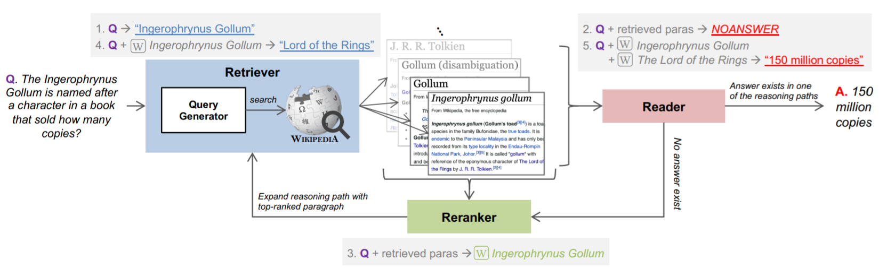

# IRRR

This repository contains the authors' implementation of the Iterative Retriever, Reader, and Reranker (IRRR) model in the EMNLP 2021 paper "[Answering Open-Domain Questions of Varying Reasoning Steps from Text](https://arxiv.org/pdf/2010.12527.pdf)".



## Run prediction on BeerQA

### Setting up
Checkout the code from our repository using
```bash
git clone https://github.com/beerqa/IRRR.git
```
This repo requires Python 3.6. Please check your shell environment's `python` before proceeding. To use ElasticSearch, make sure you also install Java Development Kit (JDK) version 8.

The setup script will download all required dependencies (python requirements,
data, models, etc.) required to run the IRRR pipeline end-to-end. Before running this script, make sure you have the Unix utility `wget` (which can be installed through anaconda as well as other common package managers).
Along the way, it will also start running Elasticsearch and index the
Wikipedia corpus locally.

_Note: This might take a while to finish and requires a large amount of disk space, so it is strongly recommended that you run this on a machine with at least 100GB of free disk space._

```bash
bash setup.sh
```

### Run prediction

Here is a quick example for running prediction using our trained model on the BeerQA dataset. It will take hours depending on the number of retrieved passages at each iteration. It requires up-to 100GB of storage for storing intermediate files when are large number of passages are retrieved at each reasoning step

```bash
bash scripts/predict_dynamic_hops.sh PREDICT_OUTPUT_PATH \
                                     ./data/beerqa/beerqa_dev_v1.0.json \
				     MODEL_OUTPUT_PATH \
				     NUM_PASSAGES_AT_EACH_ITERATION \
				     MAX_ITERATION
```

### Evaluate the prediction

Once the prediction has been made, you can use the following command to evaluate the output

```bash
python utils/eval_beerqa.py ./data/beerqa/beerqa_dev_v1.0.json \
                            PREDICT_OUTPUT_PATH/answer_predictions.json
```

## Citation

If you use IRRR in your work, please consider citing our paper

```
@inproceedings{qi2021answering,
  title={Answering Open-Domain Questions of Varying Reasoning Steps from Text},
  author = {Qi, Peng and Lee, Haejun and Sido, Oghenetegiri "TG" and Manning, Christopher D.},
  booktitle = {Empirical Methods for Natural Language Processing ({EMNLP})},
  year = {2021}
}
```

## License

All work contained in this package is licensed under the Apache License, Version 2.0. See the included LICENSE file.
